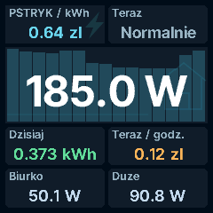
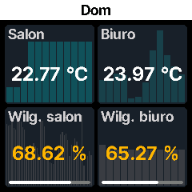
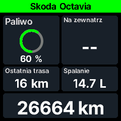

# Home Assistant Mini-Display

```text
       .----------------------------------------------.
   ~-. | Over engineered home assistant mini display   | .-~
       '----------------------------------------------'
                     .---------------.
                     |  156 W   /\/  |
                     |  tiny screen  |
                     '-------.-------'
                            _|_
```

Turn a tiny Wi-Fi display into a ridiculously configurable dashboard.
**JSON Schema powered. Local. No cloud required. Home Assistant optional.**

## Tiny screen, lots of possibilities

- Rows or free layout: drag, resize and position titles and values independently.
- Numbers, text, clocks, weather, images, progress bars, rings and charts.
- Scenes, timed pages, transitions and temporary live preview.
- Conditional visibility, value/color mappings, custom fonts and image backgrounds.
- Line and bar charts, including history behind a live value.
- Device web UI: brightness, pixel shift, fonts, Wi-Fi, time, diagnostics and updates.

The dedicated **Home Assistant integration** adds a highly configurable visual
editor for multiple displays. It forwards entity values, weather forecasts and
Recorder history. Without HA, send layouts and data directly to the local API.

## On a real display

Actual 240 × 240 screenshots from a JUZIPi SD PRO, not browser mockups.

| Energy and live power | Free layout and backgrounds |
| :---: | :---: |
|  |  |
| **Home conditions** | **Car status** |
|  |  |

## Install on JUZIPi SD PRO

Tested hardware: **JUZIPi SD PRO, ESP8266/ESP-12F, 4 MB flash, 240 × 240 ST7789**.
Check the [pinout](notes/pinout-sdpro.md) before flashing. Keep a stock firmware
backup and a recovery method; matching cases do not guarantee matching hardware.

1. Use the **sdpro** firmware from a [release](https://github.com/piotrkochan/homeassistant-minidisplay/releases),
   when available, or build it below. Rename it to `SDP-MiniDisplay.bin`.
2. Open the device's stock web UI and upload it through the firmware update page.
   The stock uploader requires a filename beginning with `SDP`.
3. After reboot, join `SDPRO-Setup-XXXXXX` and open `http://192.168.4.1/`.
4. Configure Wi-Fi. The screen shows its new IP address; open that address to
   configure the display and panel/API protection.

Subsequent updates use the device's **Firmware** page. Direct OTA uses `/update`,
not the stock `/update_ota`, and has a separate, configurable password.
If USB does not expose a serial port, recovery needs a **3.3 V USB-to-TTL adapter**,
not just a USB cable. Check the pinout before connecting anything.

### Add Home Assistant

1. In HACS, add `https://github.com/piotrkochan/homeassistant-minidisplay` as a
   custom repository, category **Integration**, and install it.
2. Restart HA. Add **Home Assistant Mini-Display** in **Settings → Devices & services**,
   or use the discovered device. Enter its address and panel/API credentials if enabled.
3. Open **Mini Displays** in the sidebar. Choose a display, create a scene and edit
   its pages. Preview on the device, then save.

Manual installation: copy `custom_components/mini_display` into HA's
`config/custom_components/` and restart.

## Hardware profiles

Only SD PRO is hardware-tested here. **Testers wanted for every other profile.**
These are build targets, not a promise that any similarly named device will work.

| Model / variant | PlatformIO target | Status |
| --- | --- | --- |
| JUZIPi SD PRO | `sdpro` | Tested on hardware |
| GeekMagic SmallTV, no-CS wiring | `geekmagic_smalltv_nocs` | Not tested; testers needed |
| GeekMagic SmallTV / Ultra, CS on GPIO15 | `geekmagic_smalltv_cs15` | Not tested; testers needed |
| GeekMagic SmallTV ESP32-C2 / ESP8684 | `geekmagic_smalltv_esp32c2` | Not tested; testers needed |
| GeekMagic SmallTV Pro, ESP32 / 8 MB | `geekmagic_smalltv_pro` | Not tested; testers needed |

ESP32 builds provide separate `factory.bin` and `ota.bin` images. Do not interchange
them or use the SD PRO installation procedure for another model. See the
[hardware notes](notes/) and report your exact board, MCU and wiring when testing.

## JSON Schema powered

The [dashboard schema](dashboard/dashboard.schema.json) describes layouts, cards,
styles, visibility and data bindings. The device also serves it at
`/schema/dashboard.schema.json`.

| Endpoint | Purpose |
| --- | --- |
| `PUT /api/v1/dashboard` | Upload a dashboard |
| `PATCH /api/v1/data` | Send values and optional chart history |
| `GET /api/v1/data` | Read retained values and history |
| `GET /api/v1/screenshot` | Capture the display as BMP |

Data keys need not be HA entity IDs. Your own application can send, for example:

```json
{"values":{"power":{"state":"156","available":true}},"render":true}
```

Bind a card to `"source": "power"`. See [the format and API notes](dashboard/README.md).
Protected endpoints use the configured panel/API credentials. **Keep the display
on a trusted LAN; HTTPS is currently disabled in the default build.**

## Build

Requires Python 3, Node.js 24, npm and Make.

```bash
python3 -m venv .venv
.venv/bin/pip install platformio==6.1.19
npm ci --prefix firmware/web
make build
```

SD PRO output: `firmware/.pio/build/sdpro/firmware.bin`.
`make build-all` packages all profiles into `dist/`.

For HA frontend development: `npm ci --prefix integration/card`, then
`make card-check card-build`. Native firmware tests: `make test-native`
(requires a C++17 compiler). Memory report: `make elf-report` after building.

GitHub CI checks firmware, native tests, the HA integration and browser interactions
on code changes. Releases require passing checks. HACS validation runs separately
for public repositories and weekly to catch upstream compatibility changes.

## Credits

Hardware research and inspiration:
[JUZIPi SD_PRO](https://github.com/JUZIPi-tech/SD_PRO),
[geekmagic-hacs](https://github.com/adrienbrault/geekmagic-hacs),
[geekmagic-tv-esp8266](https://github.com/bvweerd/geekmagic-tv-esp8266),
[smalltv-mod](https://github.com/giovi321/smalltv-mod).

## License

[MIT](LICENSE). See [third-party notices](THIRD_PARTY.md) for dependencies and assets.
